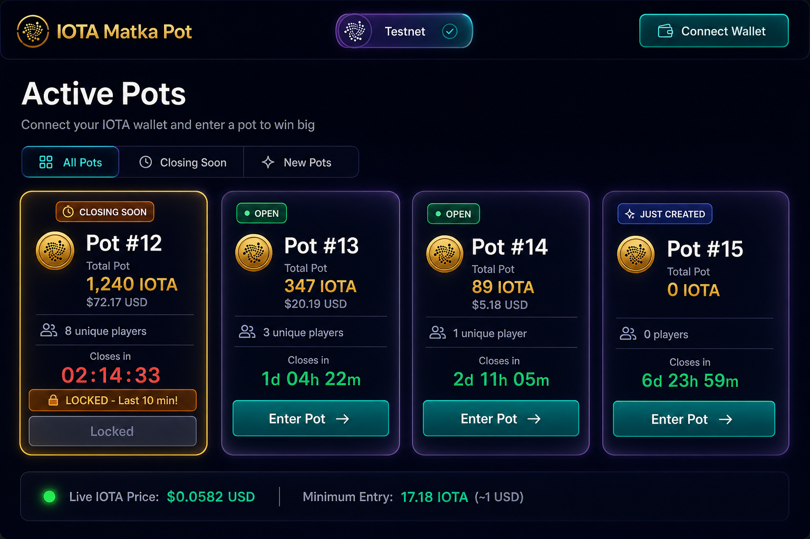
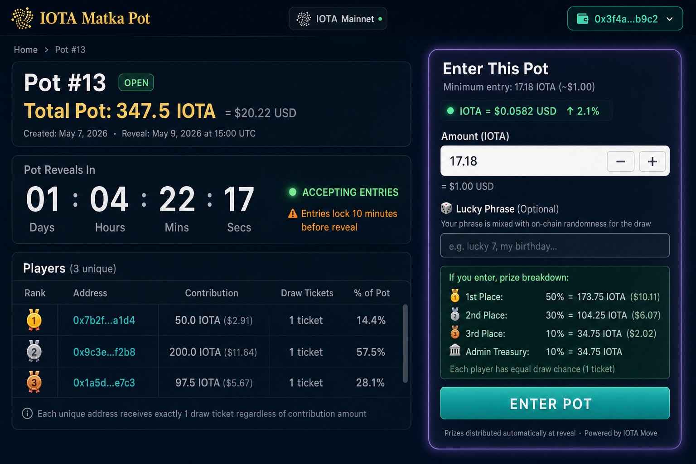
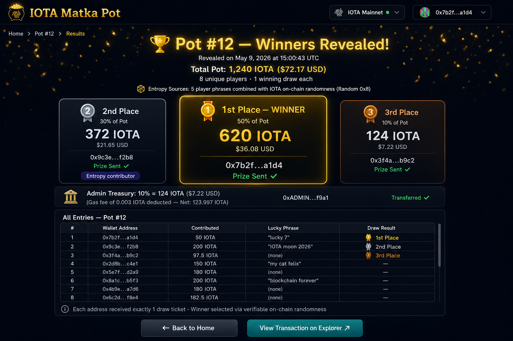
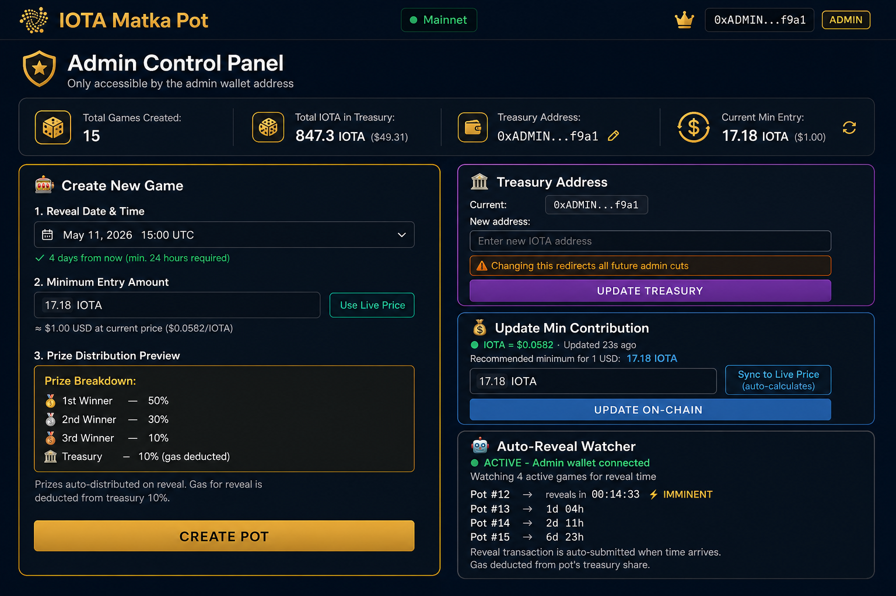
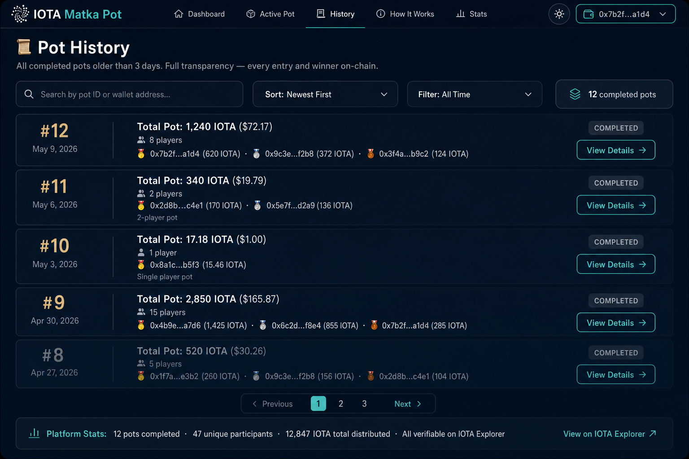
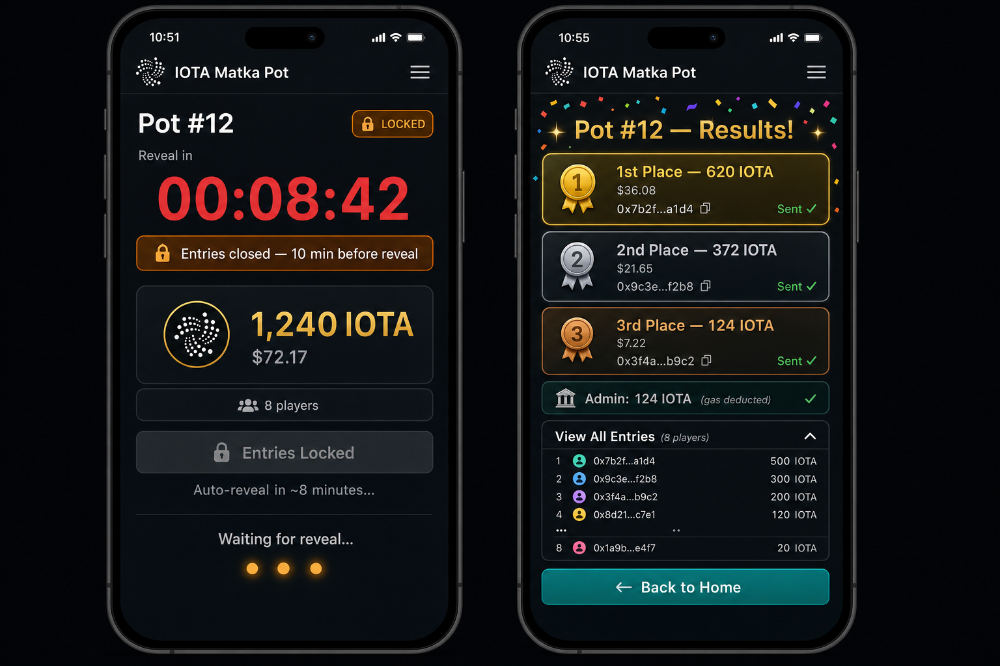
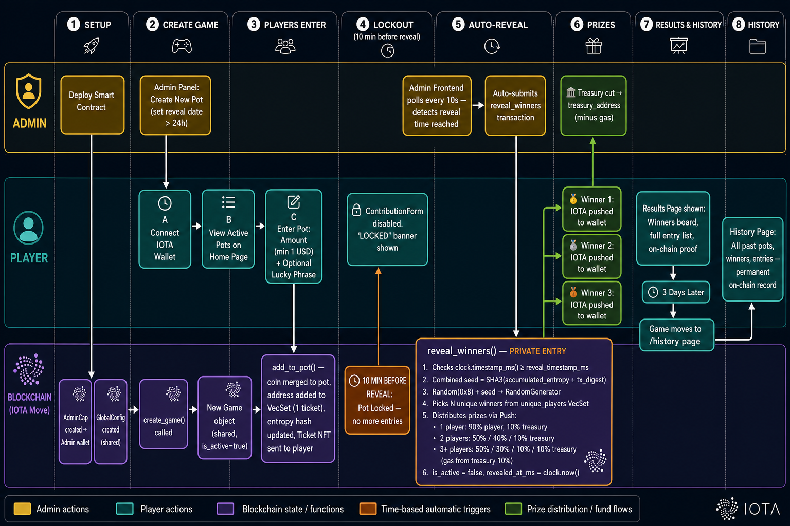

# 🎰 IOTA Matka Pot

> A fully decentralised lottery ("pot") application built on the **IOTA Layer-1 blockchain** using the Move smart contract language. No server. No database. No custodian. Everything lives on-chain.

---

## 📸 Screenshots

| Home — Active Pots | Game Detail — Contribute |
|---|---|
|  |  |

| Results — Winners Board | Admin Panel |
|---|---|
|  |  |

| History Page | Mobile View |
|---|---|
|  |  |

---

## 🌐 Live Testnet Contract

| | |
|---|---|
| **Network** | IOTA Testnet |
| **Package ID** | `0xf936757d547629b4c8c22a9a36c823de7799c6496a2910a1c11e3af8b0ee171a` |
| **GlobalConfig ID** | `0x62fe4b0e6d1a745281632d08a810182b839bb69e45bf94bba108de04fc2878e3` |
| **AdminCap ID** | `0x6effe1533ce61adbc16242a449ab08f73c2dea67669df0c999a8e2de6fc73ce7` |
| **Deployed At** | 2026-05-07 |
| **Tx Digest** | `2NW4nhNYnzMokbxeukjH5gjXfDGVTrdrcJbyPq9i12Yd` |
| **Explorer** | [View on IOTA Explorer ↗](https://explorer.iota.org/object/0xf936757d547629b4c8c22a9a36c823de7799c6496a2910a1c11e3af8b0ee171a?network=testnet) |

---

## 🔧 Bug Fixes & Changes

The following issues were identified by code review and fixed:

| Severity | Issue | Fix |
|---|---|---|
| **Critical** | `GameCreated` event missing `game_object_id` — no games ever loaded | Added `game_object_id: ID` to Move event struct |
| **High** | Entry minimum validated against live USD floor, not on-chain `min_contribution_nanos` | Validation now reads `game.minContributionNanos` directly |
| **High** | Explorer links hardcoded to `?network=testnet` | Now derived from `VITE_NETWORK` env var |
| **High** | `queryEvents` capped at 50 — all older games silently missing | Paginated until `hasNextPage = false` |
| **Medium** | Prize preview off by 1 for repeat contributors | `alreadyIn` check before incrementing `entryCount` |
| **Medium** | `getGameStatus` defaulted missing `revealedAtMs` to epoch-0 → instant `'history'` | `null` now returns `'revealed'` |
| **Medium** | `calcPrizeBreakdown` used `Number(bigint)` losing precision | Rewritten with `bigint` integer division matching `prize::calculate` |
| **Medium** | `iotaToNanos` used `Math.ceil(iota * 1e9)` (float rounding errors) | Replaced with `.toFixed(9)` string-split arithmetic |
| **Medium** | `useAutoReveal` closed over stale `signAndExecute` | Pinned in `useRef`; no longer stale across wallet reconnects |
| **Low** | `lastUpdated` in price hook was always render-time, not fetch-time | Now uses `dataUpdatedAt` from React Query |

---

## 🎯 How It Works

```
1. Admin creates a pot with a future reveal date (minimum 24 hours ahead)
2. Players connect their IOTA wallet and contribute (minimum set by on-chain GlobalConfig)
3. Each player gets 1 draw slot — equal chance regardless of contribution size
4. Players can optionally enter a "lucky phrase" — stored on-chain as entropy (cosmetic)
5. Entries lock 10 minutes before reveal time
6. At reveal time, admin's frontend auto-triggers the on-chain random draw
7. Winners receive prizes pushed directly and instantly to their wallets
8. Game moves to the History page 3 days after reveal
```

### Prize Distribution

| Players in Pot | 🥇 1st Place | 🥈 2nd Place | 🥉 3rd Place | 🏦 Admin Treasury |
|---|---|---|---|---|
| 1 player | 90% | — | — | 10% |
| 2 players | 50% | 40% | — | 10% |
| 3 or more | 50% | 30% | 10% | 10% |

- Gas fee for the reveal transaction is deducted from the treasury's 10% cut
- Admin never contributes — earns only the 10% treasury share
- All prizes are pushed automatically — no separate claim step

---

## 🚀 Quick Start (Run Locally)

### Prerequisites

| Tool | Version | Install |
|---|---|---|
| Node.js | 20+ | [nodejs.org](https://nodejs.org) |
| pnpm | 9+ | `npm install -g pnpm` |
| IOTA Wallet | Latest | [Chrome Extension](https://chromewebstore.google.com/detail/iota-wallet/) |
| Git | Any | [git-scm.com](https://git-scm.com) |

### 1. Clone the Repository

```bash
git clone https://github.com/saurabhbiswas34-bot/DataVisualization.git
cd DataVisualization
git checkout cursor/iota-matka-pot-design-5951
```

### 2. Set Up Environment

```bash
cd frontend
cp .env.testnet .env.local
```

The `.env.local` file is pre-configured with the live testnet contract IDs — no changes needed.

```env
VITE_NETWORK=testnet
VITE_PACKAGE_ID=0xf936757d547629b4c8c22a9a36c823de7799c6496a2910a1c11e3af8b0ee171a
VITE_GLOBAL_CONFIG_ID=0x62fe4b0e6d1a745281632d08a810182b839bb69e45bf94bba108de04fc2878e3
VITE_ADMIN_ADDRESS=0xe21283aba70e849dbd223d40e3fb6e71899af96afec60aa2ea09578aabfe6d38
VITE_IOTA_FULLNODE_URL=https://api.testnet.iota.cafe
```

### 3. Install & Run

```bash
pnpm install     # install dependencies (~30 seconds)
pnpm dev         # start dev server
```

Open **[http://localhost:5173](http://localhost:5173)** in your browser.

### 4. Get Testnet IOTA

Visit **[https://faucet.testnet.iota.cafe](https://faucet.testnet.iota.cafe)** and paste your wallet address to receive free testnet IOTA.

---

## 📄 Pages & Routes

| Route | Page | Description |
|---|---|---|
| `/` | **Home** | Grid of all active pots with live countdowns and IOTA price |
| `/game/:id` | **Game Detail** | Contribute IOTA, view players, see countdown |
| `/game/:id/results` | **Results** | Winners podium, prize amounts, full entry table |
| `/history` | **History** | All completed pots older than 3 days |
| `/history/:id` | **History Detail** | Full breakdown of a past game |
| `/admin` | **Admin Panel** | Create pots, manage treasury, monitor reveals *(admin wallet only)* |

---

## 🔐 Admin Panel

The admin panel is protected at two levels:

**Level 1 — Smart Contract (unbypassable):**
Every admin function requires `AdminCap` — a unique on-chain object that exists once and lives in the admin's wallet. IOTA validators reject any transaction that doesn't present it. Cannot be forged.

**Level 2 — Frontend Guard:**
The `/admin` route checks the connected wallet against `GlobalConfig.admin_address` on-chain. Wrong wallet → "Access Denied" page.

**Admin capabilities:**
- Create new pots (set reveal date, minimum 24 hours in future)
- Update treasury address
- Sync minimum contribution to live USD price
- Monitor auto-reveal watcher (10-second polling)

---

## 💾 Data Persistence

**There is no backend server or database.** All data lives permanently on the IOTA blockchain as objects:

| Data | Stored In | Permanent? |
|---|---|---|
| Game state, pot balance, winners | `Game` shared object | ✅ Forever |
| Platform config, treasury address | `GlobalConfig` shared object | ✅ Forever |
| Player contribution receipts | `Ticket` owned objects (in player wallets) | ✅ Forever |
| All contributions + reveals | IOTA event log | ✅ Forever |
| IOTA price, UI state | Browser memory only | ❌ Session only |

---

## 🏗 Project Structure

```
├── README.md
│
├── contract/                          Smart contract (IOTA Move)
│   ├── Move.toml                      Package manifest
│   ├── sources/
│   │   ├── matka_pot.move             Main module — all structs & functions
│   │   ├── events.move                Event struct definitions
│   │   └── prize.move                 Prize calculation logic
│   ├── tests/
│   │   └── matka_pot_tests.move       12 Move unit tests (all passing)
│   ├── .deployed.testnet.json         Live contract IDs
│   └── TESTNET_STATUS.md              Deployment record
│
├── frontend/                          React application
│   ├── src/
│   │   ├── pages/                     6 page components
│   │   ├── components/                13 UI components
│   │   ├── hooks/                     5 custom React hooks
│   │   ├── transactions/              5 PTB transaction builders
│   │   ├── utils/                     4 utility modules
│   │   ├── types/                     TypeScript interfaces
│   │   ├── networkConfig.ts           Chain config & constants
│   │   ├── App.tsx                    Router
│   │   ├── main.tsx                   Providers entry point
│   │   ├── __tests__/                 344 unit + component tests
│   │   └── test-utils/                Shared test helpers & factories
│   ├── vitest.config.ts               Unit test config (v8 coverage)
│   ├── vitest.integration.config.ts   Testnet integration test config
│   ├── .env.testnet                   Testnet environment (committed)
│   ├── .env.mainnet                   Mainnet environment (fill when ready)
│   ├── .env.local.example             Template for local setup
│   └── vercel.json                    Vercel deployment config
│
└── design/                            All design documentation
    ├── HLD.md                         High Level Design
    ├── LLD.md                         Low Level Design
    ├── SECURITY.md                    Admin & contract security
    ├── PERSISTENCE.md                 Data storage model
    ├── DEPLOYMENT.md                  Vercel + testnet guide
    ├── AGENT_EXECUTION_PLAN.md        7-agent build plan
    ├── SKILLS.md                      Tech competency map
    ├── CONTEXT.md                     Full project context
    └── images/                        7 UI mockup screenshots
```

---

## 🔧 Smart Contract Functions

| Function | Access | Description |
|---|---|---|
| `create_game` | Admin only | Create a new pot with reveal date |
| `add_to_pot` | Any wallet | Contribute IOTA + optional lucky phrase |
| `reveal_winners` | Auto (admin) | Draw winners using on-chain randomness |
| `update_treasury_address` | Admin only | Change where treasury cut is sent |
| `update_min_contribution` | Admin only | Update minimum entry amount |

```bash
# Move unit tests
cd contract
iota move test
# → Test result: OK. Total tests: 12; passed: 12; failed: 0

# Frontend unit + component tests (344 tests, ~14s)
cd frontend
pnpm test

# Frontend tests with v8 coverage report
pnpm test:coverage
# → 100% statement/line coverage

# Live testnet integration tests (requires network access)
pnpm test:integration
# → 30 tests against IOTA testnet (contract state, faucet, AdminCap)
```

---

## ⚙️ Tech Stack

| Layer | Technology | Purpose |
|---|---|---|
| Smart Contract | IOTA Move (L1) | Game logic, prize distribution, randomness |
| Randomness | `iota::random` (0x8) | Verifiable on-chain random draw |
| Clock | `iota::clock` (0x6) | Reveal timing, lockout enforcement |
| Frontend | React 18 + TypeScript | User interface |
| Build Tool | Vite 5 | Fast dev server & bundler |
| Blockchain SDK | `@iota/dapp-kit` + `@iota/iota-sdk` | Wallet connect, queries, transactions |
| Data Fetching | `@tanstack/react-query` | Cached blockchain data with auto-refetch |
| Styling | Tailwind CSS 4 + Radix UI | Dark theme, responsive layout |
| Routing | React Router DOM v6 | Client-side navigation |
| Price Feed | CoinGecko API → Binance fallback | Live IOTA/USD price |
| Hosting | Vercel | Frontend CDN deployment |

---

## 🚢 Deploy to Vercel

```bash
cd frontend

# Install Vercel CLI
npm install -g vercel

# Login with GitHub
vercel login

# First deploy (follow prompts)
vercel

# Set environment variables when prompted (or via dashboard):
#   VITE_NETWORK              = testnet
#   VITE_PACKAGE_ID           = 0xf936757d...
#   VITE_GLOBAL_CONFIG_ID     = 0x62fe4b0e...
#   VITE_ADMIN_ADDRESS        = 0xe21283ab...
#   VITE_IOTA_FULLNODE_URL    = https://api.testnet.iota.cafe

# Promote to production
vercel --prod
```

For CI/CD (auto-deploy on every git push), connect the repo in the [Vercel Dashboard](https://vercel.com/dashboard) and set environment variables there.

---

## 🌍 Deploy Your Own Contract

If you want to be the admin with your own wallet:

```bash
# Install IOTA CLI
curl -fsSL https://get.iota.org | sh

# Create wallet and get testnet tokens
iota client new-address ed25519
iota client switch --env testnet
iota client faucet

# Deploy
cd contract
iota client publish --gas-budget 100000000

# Note the output:
#   PackageID      → VITE_PACKAGE_ID
#   GlobalConfig   → VITE_GLOBAL_CONFIG_ID
#   AdminCap       → stored in YOUR wallet

# Update frontend/.env.local with your new IDs
```

---

## 📚 Documentation

| Document | Description |
|---|---|
| [HLD.md](design/HLD.md) | System architecture, actors, tech stack |
| [LLD.md](design/LLD.md) | Move structs, function specs, file tree |
| [SECURITY.md](design/SECURITY.md) | AdminCap protection, attack surface |
| [PERSISTENCE.md](design/PERSISTENCE.md) | Where every byte of data lives |
| [DEPLOYMENT.md](design/DEPLOYMENT.md) | Step-by-step Vercel + testnet guide |
| [CONTEXT.md](design/CONTEXT.md) | Full project context — read first |
| [SKILLS.md](design/SKILLS.md) | Required tech skills reference |

---

## 🗺 Workflow Diagram



---

## 🧩 Key Design Decisions

| Decision | Choice | Reason |
|---|---|---|
| Smart contract layer | IOTA Move L1 (not EVM) | Native `iota::random` and `iota::clock` only on L1 |
| Winner selection | 1 address = 1 ticket | Fair draw regardless of wealth |
| Prize delivery | Push (automatic) | No separate claim step needed |
| Admin identity | `AdminCap` object | Cryptographically unforeable, not just address check |
| Reveal trigger | Admin frontend polls every 10s | Blockchain can't self-execute; admin's browser does it |
| Gas for reveal | Deducted from treasury 10% | Admin is compensated from their own cut |
| Minimum entry | Set by `GlobalConfig.min_contribution_nanos` (17.2 IOTA default) | Admin can update to reflect live USD price |
| Data storage | Fully on-chain (IOTA objects) | No server, no database, immutable history |
| History threshold | 3 days after reveal | Keeps home page clean; results still permanently accessible |

---

## ❓ FAQ

**Q: Can the admin cheat the random draw?**
A: No. The draw uses `iota::random::Random` (address `0x8`) — a system object maintained by IOTA validators. The function is `private entry`, preventing any external contract from calling it and selectively reverting. The result is deterministic, verifiable, and manipulation-proof.

**Q: What happens if no one enters a pot?**
A: The reveal will fail with `ENotEnoughPlayers`. The admin can choose to cancel or leave the pot for more players.

**Q: What if the admin never triggers the reveal?**
A: The admin's frontend auto-triggers it. If the admin is offline, any user can also trigger it manually — the `reveal_winners` function is callable by any wallet after the deadline.

**Q: Is the contribution amount stored on-chain?**
A: Yes. The `contributions` table inside the `Game` object records every address and their cumulative contribution amount permanently.

**Q: What happens to lucky phrases?**
A: They are hashed (SHA3-256 rolling accumulation) and stored in `accumulated_entropy` on the `Game` object. Individual phrases are visible in `TicketIssued` events. **Note:** in the current contract version `accumulated_entropy` is stored for auditing purposes only — the winner draw uses `iota::random::Random` (0x8) exclusively. The lucky phrase does not affect draw odds.

**Q: Can I run multiple pots at the same time?**
A: Yes. The admin can create unlimited concurrent pots. The Home page shows all active ones simultaneously.

---

## 📜 License

MIT — free to use, fork, and build on.

---

*Built with ❤️ on IOTA — the feeless, sustainable blockchain for the real world.*
